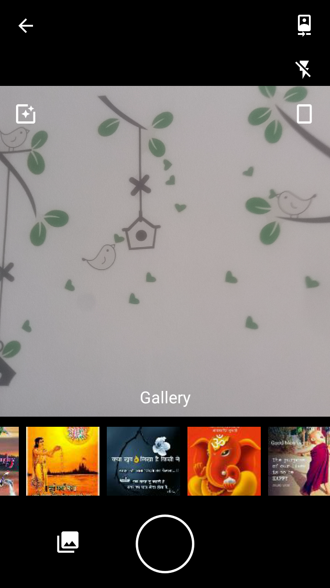

# Android Media Picker

[](https://www.android.com/)
[](https://jitpack.io/#pankajsoni19/AndroidMedia)

* AndroidX support
* Supports picking multiple media files from gallery and camera
* Support square, rectangle camera
* Supports media/video effect filters
* No ffmpeg



## About

This fork is a collection of forks from the original creator. 

We have been using ffmpeg from java-cpp in android for recording square videos. It is excellent library, however we faced issues related to threads, ffmpeg loading, using realm and webrtc alongside it, and a very bloated apk.
Though we have sorted all those issues out, we would like a simpler approach natively supported by android. 

We will try to maintain the repository as best we can. All pull requests are welcome. 
Though bugs will only be solved that we face in our projects.

The intention is to sort out the edge cases and make it available as a library project.

### Using in your project

1. Include jitpack.io maven repo ( app build.gradle)

```
    repositories {
        maven { url "https://jitpack.io" }
    }

```

2. Add dependency to project ( app build.gradle)

```
    dependencies {
        implementation 'com.github.pankajsoni19:AndroidMedia:1.1.0'
    }

```

### Usage

##### To Pick Image

```
    private void startPicker() {
             new MediaPickerOpts.Builder()
                            .setMediaType(MediaType.IMAGE)
                            .canChangeScaleType(Boolean.valueOf("true"))
                            .withGallery(Boolean.valueOf("true"))
                            .withCameraType(ScaleType.SCALE_SQUARE)
                            .withFlash(Boolean.valueOf("true"))
                            .withMaxSelection(Integer.parseInt("1"))
                            .withFilters(Boolean.valueOf("true"))
                            .withCropEnabled(Boolean.valueOf("true"))                           
                            .build()
                            .startActivity(this);
        }
    }
    
```

##### To Pick Profile Image

```
    private void startPicker() {
             new MediaPickerOpts.Builder()
                            .setMediaType(MediaType.IMAGE)
                            .canChangeScaleType(Boolean.valueOf("true"))
                            .withGallery(Boolean.valueOf("true"))
                            .withCameraType(ScaleType.SCALE_SQUARE)
                            .withFlash(Boolean.valueOf("true"))
                            .withMaxSelection(Integer.parseInt("1"))
                            .withFilters(Boolean.valueOf("true"))
                            .withCropEnabled(Boolean.valueOf("true"))
                            .withImgSize(Integer.valueOf("96"))
                            .build()
                            .startActivity(this);
        }
    }
    
```

##### To Pick Video

```
    new MediaPickerOpts.Builder()
                    .setMediaType(MediaType.VIDEO)
                    .canChangeScaleType(Boolean.valueOf("true"))
                    .withGallery(Boolean.valueOf("true"))
                    .withCameraType(ScaleType.SCALE_SQUARE)
                    .withFlash(Boolean.valueOf("true"))
                    .withMaxSelection(Integer.parseInt("2"))
                    .withFilters(Boolean.valueOf("true"))
                    .build()
                    .startActivity(this);
    
```

##### Handle Result
  
```
    
    @Override
    protected void onActivityResult(int requestCode, int resultCode, Intent data) {
        super.onActivityResult(requestCode, resultCode, data);
        Result result = MediaPicker.onActivityResult(requestCode, resultCode, data);
        if (result != null) {
            for (String file: result.files) {
                Log.d(TAG, "file: picked: " + file);
            }
        }
    }

```